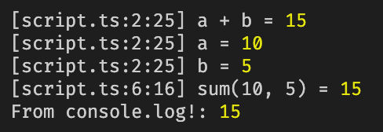

<div align="center">

# dbg

Rust's [dbg!](https://doc.rust-lang.org/std/macro.dbg.html) for JavaScript, logging values with context effortlessly.


</div>

## Features

- Easy to use, no need to import anything, it's available globally.
- Works in any JavaScript runtime, including Node.js, browsers, Bun, etc.
- Supports modern bundlers via [unplugin](https://github.com/unjs/unplugin).

## Usage

In your code, just use `dbg` like this:

- `dbg()`: void
- `dbg(expr)`: expr
- `dbg(expr, expr2, expr3)`: [expr, expr2, expr3]

```ts
function sum(a: number, b: number) {
  const [res, _a, _b] = dbg(a + b, a, b);
  return res;
}

const result = dbg(sum(10, 5));

console.log('From console.log!:', result);

// Output:
// [script.ts:2:25] a + b = 15
// [script.ts:2:25] a = 10
// [script.ts:2:25] b = 5
// [script.ts:6:16] sum(10, 5) = 15
// From console.log!: 15
```



## Install

```bash
# npm
npm i unplugin-dbg

# pnpm
pnpm i unplugin-dbg

# yarn
yarn add unplugin-dbg
```

(Optional) Add types if you use TypeScript:

```json
// tsconfig.json
{
  "compilerOptions": {
    "types": ["unplugin-dbg/globals"]
  }
}
```

Add the plugin to your bundler config:

<details>
<summary>Vite</summary><br>

```ts
// vite.config.ts
import dbg from 'unplugin-dbg/vite';

export default defineConfig({
  plugins: [
    dbg({
      /* options */
    }),
  ],
});
```

<br></details>

<details>
<summary>Rollup</summary><br>

```ts
// rollup.config.js
import dbg from 'unplugin-dbg/rollup';

export default {
  plugins: [
    dbg({
      /* options */
    }),
  ],
};
```

<br></details>

<details>
<summary>Webpack</summary><br>

```ts
// webpack.config.js
module.exports = {
  /* ... */
  plugins: [
    require('unplugin-dbg/webpack')({
      /* options */
    }),
  ],
};
```

<br></details>

<details>
<summary>Nuxt</summary><br>

```ts
// nuxt.config.js
export default defineNuxtConfig({
  modules: [
    [
      'unplugin-dbg/nuxt',
      {
        /* options */
      },
    ],
  ],
});
```

> This module works for both Nuxt 2 and [Nuxt Vite](https://github.com/nuxt/vite)

<br></details>

<details>
<summary>Vue CLI</summary><br>

```ts
// vue.config.js
module.exports = {
  configureWebpack: {
    plugins: [
      require('unplugin-dbg/webpack')({
        /* options */
      }),
    ],
  },
};
```

<br></details>

<details>
<summary>esbuild</summary><br>

```ts
// esbuild.config.js
import { build } from 'esbuild';
import dbg from 'unplugin-dbg/esbuild';

build({
  plugins: [dbg()],
});
```

<br></details>

```ts
import type { Options as SwcOptions } from '@swc/core';

export interface Options {
  /**
   * Whether to enable the plugin.
   *
   * @default true
   */
  enabled?: boolean;
  /**
   * Base options for SWC.
   */
  baseSwcOptions?: SwcOptions | ((code: string, id: string) => SwcOptions);
}
```

---

<details>
<summary>Advanced usage</summary><br>

```ts
// Use the plugin with SWC
swc.transform(code, {
  jsc: {
    experimental: {
      plugins: [
        [
          'unplugin-dbg/swc-plugin',
          {
            enabled: true, // Required
          },
        ],
      ],
    },
  },
});
```

```ts
// Use `dbg` manually
import { _ as dbg } from 'unplugin-dbg/runtime';

// Without location context
dbg.call(
  null,
  {
    expr: '<expr>',
    value: expr,
  },
  {
    expr: '10 + 5',
    value: 10 + 5,
  }
  // ...
);

// With location context
dbg.call(
  {
    file: 'script.ts',
    line: 1,
    col: 1,
  },
  {
    expr: '<expr>',
    value: expr,
  },
  {
    expr: '10 + 5',
    value: 10 + 5,
  }
  // ...
);
```

<br></details>

## License

[MIT](./LICENSE)
